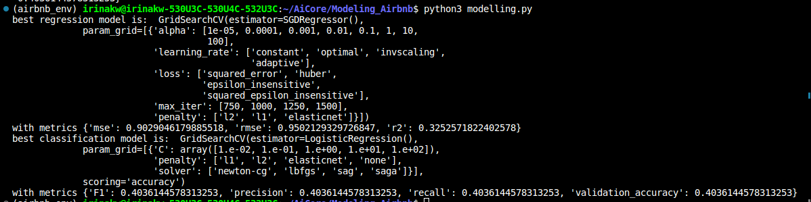

# Modeling_Airbnb
> Modelling Airbnb's property listing dataset 

## Table of Contents
* [General Info](#general-information)
* [Technologies Used](#technologies-used)
* [Features](#features)
* [Screenshots](#screenshots)
* [Setup](#setup)
* [Usage](#usage)
* [Project Status](#project-status)
* [Room for Improvement](#room-for-improvement)
* [Acknowledgements](#acknowledgements)
* [Contact](#contact)
<!-- * [License](#license) -->


## General Information
- Build a framework that systematically train, tune, and evaluate models on several tasks that are tackled by the Airbnb team 


## Technologies Used
joblib==1.2.0
matplotlib==3.6.2
numpy==1.23.4
opencv_python==4.6.0.66
pandas==1.5.1
requests==2.25.1
scikit_learn==1.1.3


## Features
-The tabular dataset has the following columns:
    ID: Unique identifier for the listing
    Category: The category of the listing
    Title: The title of the listing
    Description: The description of the listing
    Amenities: The available amenities of the listing
    Location: The location of the listing
    guests: The number of guests that can be accommodated in the listing
    beds: The number of available beds in the listing
    bathrooms: The number of bathrooms in the listing
    Price_Night: The price per night of the listing
    Cleanliness_rate: The cleanliness rating of the listing
    Accuracy_rate: How accurate the description of the listing is, as reported by previous guests
    Location_rate: The rating of the location of the listing
    Check-in_rate: The rating of check-in process given by the host
    Value_rate: The rating of value given by the host
    amenities_count: The number of amenities in the listing
    url: The URL of the listing
    bedrooms: The number of bedrooms in the listing
- Cleaning process of tabular data:
    remove columns with missing values
    modify Description column by turning it into a string
    for "guests", "beds", "bathrooms", and "bedrooms" columns empty entries are replaced with 1.
- Preparation of image data:
    all images are downloaded and processed through usage of ID column of the matching tabular data
    all images are resized, the height of the smallest image is set as the height for all of the other images.
    w by h ratio is preserved
    resized images are saved into the new data/processed_images location
- Model Training to predict the price for the listing per night - Regression:
    Use sklearn to compute the key measures of performance forthe  model: RMSE, and R^2.
    Create a function which performs a grid search over a reasonable range of hyperparameter values manually, followed by CVGrideSearch
    Use decision trees, random forests, and gradient boosting regression models to determine the best model after the CVGrid Search based on R2 scores
- Model Training to predict the Cateogry label - Classification:
    Use sklearn to compute the key measures of performance for your classification model: F1, recall, precision, validation accuracy.
    Update tunning function to include classification model tuning with CVGrideSearch
    Use decision trees, random forests, and gradient boosting classification models to determine the best model after the CVGrid Search best on validation accuracy scores.

    

## Screenshots




## Setup
All dependancies are listed in the requirements.txt


## Usage
The hyperparamteters_grids.py contains 8 dictionary grids: 4 for regressionmodels and 4 for classification models
```
#Hyperparameteres grids
sgd_param = {'alpha': [1e-5, 1e-4, 1e-3, 1e-2, 1e-1, 1, 10, 100],
    'learning_rate': ['constant', 'optimal', 'invscaling', 'adaptive'],
    'loss': ['squared_error', 'huber', 'epsilon_insensitive','squared_epsilon_insensitive'],
    'penalty' : ['l2', 'l1', 'elasticnet'],
    'max_iter' : [750, 1000, 1250, 1500]}

decision_tree_param={"splitter":["best","random"],
    "max_depth" : [1,3,5,7,9,11,12],
    "min_samples_leaf":[1,2,3,4,5,6,7,8,9,10],
    "min_weight_fraction_leaf":[0.1,0.2,0.3,0.4,0.5],
    "max_features":[1.0, "log2","sqrt",None],
    "max_leaf_nodes":[None,10,20,30,40,50,60,70,80,90]}

gradient_boosting_class_param={
    "loss":["deviance"],
    "learning_rate": [0.01, 0.025, 0.05, 0.075, 0.1, 0.15, 0.2],
    "min_samples_split": np.linspace(0.1, 0.5, 12),
    "min_samples_leaf": np.linspace(0.1, 0.5, 12),
    "max_depth":[3,5,8],
    "max_features":["log2","sqrt"],
    "criterion": ["friedman_mse",  "mae"],
    "subsample":[0.5, 0.618, 0.8, 0.85, 0.9, 0.95, 1.0],
    "n_estimators":[10]

```


## Project Status
Project is: _in progress_ 


## Room for Improvement
- Done: train regression models with tuning hyperparamters
- Done: train classification models with tuning hyperparameters 
- To Do: Nural Network 


## Acknowledgements
- This project was inspired by AiCore program.

## Contact
Created by [@irinakw](irina.k.white@gmail.com) - feel free to contact me!

